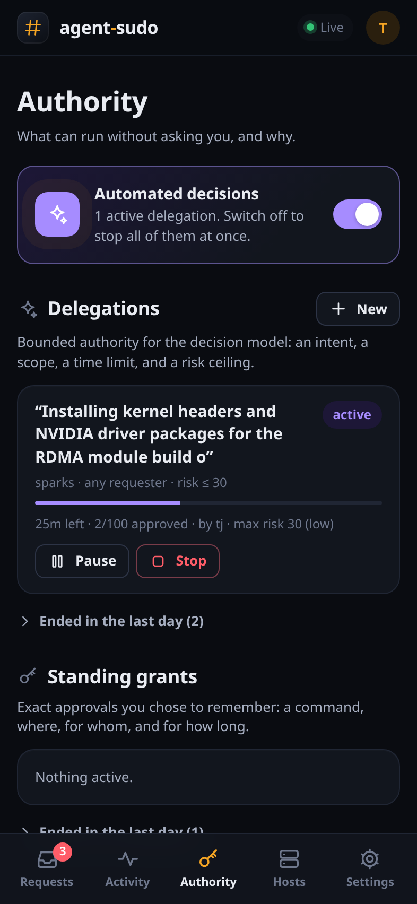

<p align="center"></p>

# agent-sudo

**sudo for machines where coding agents do the typing.** When an agent runs `sudo`,
your phone buzzes. You see the exact command, where it runs, why the agent says it
needs it, and a risk assessment. One tap approves it. A human at the terminal can
still just type the password.

<p align="center">
  
  
  
</p>

- **Drop-in.** A feature-gated fork of [sudo-rs](https://github.com/trifectatechfoundation/sudo-rs),
  so sudoers, `-u`, `-i`, `sudoedit`, environment handling and PTYs behave like sudo.
  Agents opt in through a PATH shim and never need to know it exists.
- **Your sudoers stays the ceiling.** The approval service can replace the password,
  never widen what sudoers allows. Denied and NOPASSWD commands never leave the host.
- **Passkeys everywhere it matters.** One-tap approvals from a signed-in device;
  root shells, credentials, and changes to sudo itself need Face ID, Touch ID or
  Windows Hello.
- **Scoped memory.** Approve once, or remember "this exact command, on the sparks
  group, for this agent session, for 30 minutes".
- **A decision assistant.** Any OpenAI-compatible model (or OpenRouter's Decisions
  API) scores risk across seven dimensions, reads recent fleet history, and pre-fills
  the scope you'd probably pick. Secrets are redacted before it sees anything.
- **Delegations.** Hand the model a bounded slice of authority: "for the next hour,
  approve work that fits *installing the NVIDIA driver stack on the sparks*, up to
  low risk". Root shells, credentials and sudo changes always come back to you. One
  switch stops all automation.
- **Built for the web you already have.** A PWA with Web Push: notification buttons
  on Edge and Chrome, Home Screen app on iPhone, Safari on the Mac.

## How it works

```
agent ──sudo──> agent-sudo (setuid, sudo-rs fork)
                  │ sudoers says: allowed, needs authentication
                  │ root-only socket
                  v
                agent-sudo-hostd (root) ──signed HTTPS──> approval service ──push──> your devices
                  │ session facts from /proc                  │ grants, delegations, audit
                  │                                           │ optional decision model
                  └──────────── decision ◄────────────────────┘
```

With a terminal, the normal password prompt stays up and races the remote decision;
whichever succeeds first wins. Without one (the usual agent case), sudo prints
`waiting for approval [K7QX] https://…` and blocks until you decide.

## Quick start

1. **Run the service** where your devices can reach it over HTTPS. The Tailscale
   profile gives you a real certificate on your tailnet with no open ports:

   ```sh
   cd deploy/service
   cp .env.example .env && cp service.example.toml service.toml   # fill in both
   docker compose --profile tailscale up -d
   docker compose logs service | grep setup   # open the one-time setup link
   ```

2. **Set up your account**: create the admin, add a passkey, turn on notifications
   (on iPhone, Add to Home Screen first).

3. **Enroll a host**: Hosts → Add a host gives you a one-time command.

   ```sh
   docker build --target host-dist --output dist .   # or grab a release
   sudo dist/install.sh --enroll https://agent-sudo.your-tailnet.ts.net <token>
   ```

4. **Point an agent at it**, in the agent's environment only:

   ```sh
   agent-sudo-hostd shim install          # ~/.agent-tools/sudo -> agent-sudo
   export PATH="$HOME/.agent-tools:$PATH"
   ```

   Optionally add [`skills/agent-sudo`](skills/agent-sudo/SKILL.md) so agents explain
   themselves with `--agent-context`.

The full walkthrough, including the nginx profile and arm64 builds, is in
[docs/DEPLOY.md](docs/DEPLOY.md).

<p align="center">
  
</p>

## Documentation

| | |
| --- | --- |
| [docs/DEPLOY.md](docs/DEPLOY.md) | Running the service, enrolling hosts, agent setup |
| [docs/ADVISOR.md](docs/ADVISOR.md) | Decision models, delegations, calibration |
| [docs/SECURITY.md](docs/SECURITY.md) | Threat model, invariants, step-up rules |
| [docs/PROTOCOL.md](docs/PROTOCOL.md) | Socket, host API and push formats |
| [docs/PROPOSAL.md](docs/PROPOSAL.md), [docs/DECISIONS.md](docs/DECISIONS.md) | Original design and how the build departed from it |
| [sudo/AGENT_SUDO_PATCH.md](sudo/AGENT_SUDO_PATCH.md) | Exactly what the sudo-rs fork changes |

## Development

```sh
cargo test --workspace                                   # protocol, hostd, service
(cd sudo && cargo test --features agent-approval)        # the fork, with and without
(cd service/web && npm ci && npm run build)              # the UI
(cd e2e && npm ci && ./run.sh)                           # end to end, in Docker
```

The end-to-end suite builds a real host container (setuid binary, PAM, sudoers,
hostd), the service behind TLS from a throwaway CA, and a mock decision model, then
drives everything from Playwright with a virtual passkey: terminal races, grants,
delegations, the kill switch, push notifications and more. It needs Docker and
nothing else; no step touches the machine's own sudo.

For UI work, run the service with `web_dir` pointing at `service/web/dist` and
`public_url = "http://localhost:8787"`; `e2e/tools/fake_sudo.py` speaks the socket
protocol so you can create requests without root.

## License

Apache-2.0 OR MIT, like sudo-rs. The `sudo/` directory is a subtree of sudo-rs and
keeps its original notices.
