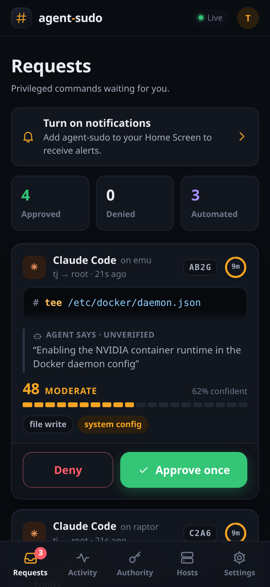
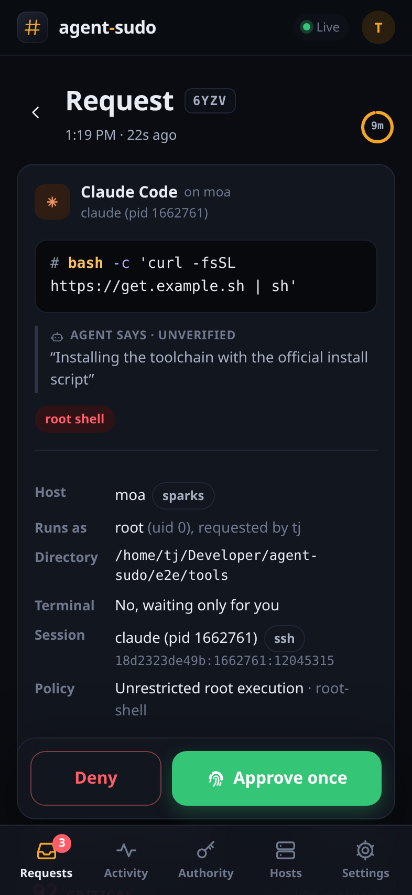
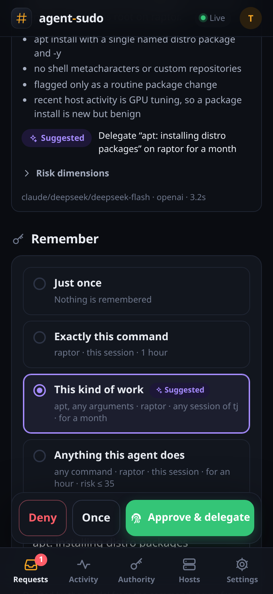
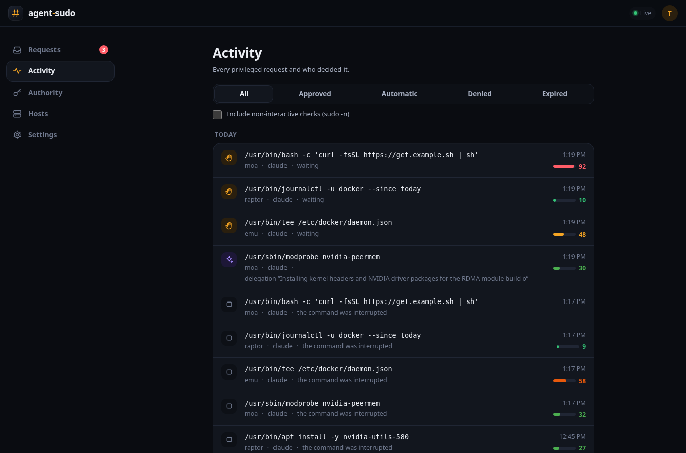

<p align="center"></p>

# agent-sudo

**sudo for machines where coding agents do the typing.** When an agent runs `sudo`,
your phone buzzes. You see the exact command, where it runs, why the agent says it
needs it, and a risk assessment. One tap approves it. A human at the terminal can
still just type the password.

<p align="center">
  
  
  
</p>

- **Drop-in.** A feature-gated fork of [sudo-rs](https://github.com/trifectatechfoundation/sudo-rs),
  so sudoers, `-u`, `-i`, `sudoedit`, environment handling and PTYs behave like sudo.
  Agents opt in through a PATH shim and never need to know it exists.
- **Your sudoers stays the ceiling.** The approval service can replace the password,
  never widen what sudoers allows. Denied and NOPASSWD commands never leave the host.
- **Passkeys everywhere it matters.** One-tap approvals from a signed-in device;
  root shells, credentials, and changes to sudo itself need Face ID, Touch ID or
  Windows Hello.
- **Scoped memory.** Approve once, or remember "this exact command, on the sparks
  group, for this agent session, for 30 minutes".
- **A decision assistant.** Any OpenAI-compatible model (or OpenRouter's Decisions
  API) scores risk across seven dimensions, reads recent fleet history, and pre-fills
  the scope you'd probably pick. Secrets are redacted before it sees anything.
- **Delegations.** Approve once and let the model handle *this kind of work* from
  then on: the model drafts "set-gpu-power: adjusting GPU power limits", you tap
  approve, and the next request for that program is judged in seconds, whatever the
  values. Rules last an hour, a day, a month or forever; a second approval widens
  the rule instead of piling up new ones. Root shells, credentials and sudo changes
  always come back to you. One switch stops all automation.
- **Built for the web you already have.** A PWA with Web Push: notification buttons
  on Edge and Chrome, Home Screen app on iPhone, Safari on the Mac.

## How it works

```
agent ──sudo──> agent-sudo (setuid, sudo-rs fork)
                  │ sudoers says: allowed, needs authentication
                  │ root-only socket
                  v
                agent-sudo-hostd (root) ──signed HTTPS──> approval service ──push──> your devices
                  │ session facts from /proc                  │ grants, delegations, audit
                  │                                           │ optional decision model
                  └──────────── decision ◄────────────────────┘
```

With a terminal, the normal password prompt stays up and races the remote decision;
whichever succeeds first wins. Without one (the usual agent case), sudo prints
`waiting for approval [K7QX] https://…` and blocks until you decide.

## Quick start

1. **Create the service deployment** where your devices can reach it over HTTPS. The
   interactive `init` asks about the front door (Tailscale or your own certificate)
   and an optional decision model, tests the model, and writes a ready folder:

   ```sh
   brew install tpurtell/local-ai/agent-sudo
   agent-sudo-service init agent-sudo
   # without Homebrew:
   #   docker run --rm -it --user "$(id -u):$(id -g)" -v "$PWD:/out" \
   #     ghcr.io/tpurtell/agent-sudo-service init /out/agent-sudo
   cd agent-sudo && docker compose up -d
   docker compose logs service | grep setup          # the one-time setup link
   ```

2. **Set up your account**: create the admin, add a passkey, turn on notifications
   (on iPhone, Add to Home Screen first).

3. **Enroll hosts.** Hosts → Add gives you two lines for each machine:

   ```sh
   brew install tpurtell/local-ai/agent-sudo
   sudo "$(brew --prefix)/bin/agent-sudo-setup" --enroll https://agent-sudo.your-tailnet.ts.net <token>
   ```

   The setup step verifies the bundle and installs it root-owned in `/usr/local`,
   because a setuid binary must never run from a prefix your agents can write. It never
   touches `/usr/bin/sudo`. After `brew upgrade agent-sudo`, run the setup line again
   without arguments. Hosts without Homebrew can use the `curl` line the sheet also
   shows.

4. **Teach your agents**, as your own user:

   ```sh
   agent-sudo-hostd skill install    # Claude Code, Codex, Gemini, Cursor, and 19 more
   ```

   Agents with the skill call `agent-sudo --agent-context "why" …`. For agents without
   it, `agent-sudo-hostd shim install` makes plain `sudo` go through agent-sudo in
   that agent's environment. See [docs/AGENTS.md](docs/AGENTS.md).

The full walkthrough is in [docs/DEPLOY.md](docs/DEPLOY.md).

<p align="center">
  
</p>

## Documentation

| | |
| --- | --- |
| [docs/DEPLOY.md](docs/DEPLOY.md) | Running the service, enrolling hosts, agent setup |
| [docs/AGENTS.md](docs/AGENTS.md) | The agent skill and where 23 coding agents read it |
| [docs/RELEASING.md](docs/RELEASING.md) | Cutting a release: source tarball, images, Homebrew bottles |
| [docs/ADVISOR.md](docs/ADVISOR.md) | Decision models, delegations, calibration |
| [docs/SECURITY.md](docs/SECURITY.md) | Threat model, invariants, step-up rules |
| [docs/PROTOCOL.md](docs/PROTOCOL.md) | Socket, host API and push formats |
| [docs/PROPOSAL.md](docs/PROPOSAL.md), [docs/DECISIONS.md](docs/DECISIONS.md) | Original design and how the build departed from it |
| [sudo/AGENT_SUDO_PATCH.md](sudo/AGENT_SUDO_PATCH.md) | Exactly what the sudo-rs fork changes |

## Development

```sh
cargo test --workspace                                   # protocol, hostd, service
(cd sudo && cargo test --features agent-approval)        # the fork, with and without
(cd service/web && npm ci && npm run build)              # the UI
(cd e2e && npm ci && ./run.sh)                           # end to end, in Docker
```

The end-to-end suite builds a real host container (setuid binary, PAM, sudoers,
hostd), the service behind TLS from a throwaway CA, and a mock decision model, then
drives everything from Playwright with a virtual passkey: terminal races, grants,
delegations, the kill switch, push notifications and more. It needs Docker and
nothing else; no step touches the machine's own sudo.

For UI work, run the service with `web_dir` pointing at `service/web/dist` and
`public_url = "http://localhost:8787"`; `e2e/tools/fake_sudo.py` speaks the socket
protocol so you can create requests without root.

## License

Apache-2.0 OR MIT, like sudo-rs. The `sudo/` directory is a subtree of sudo-rs and
keeps its original notices.
